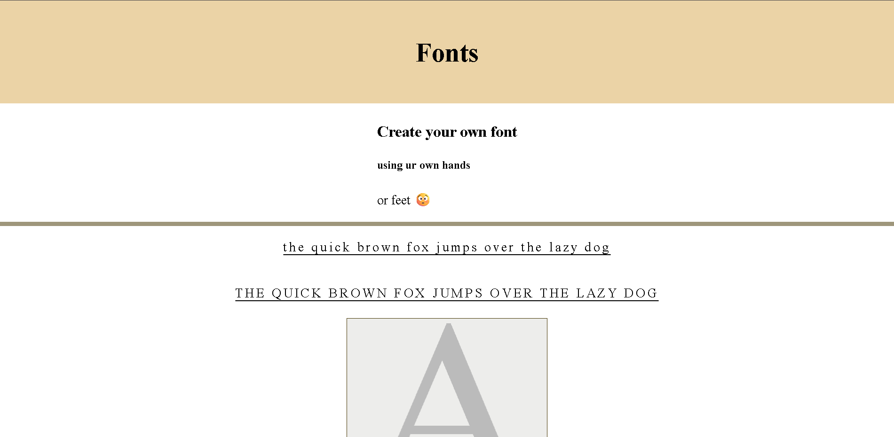
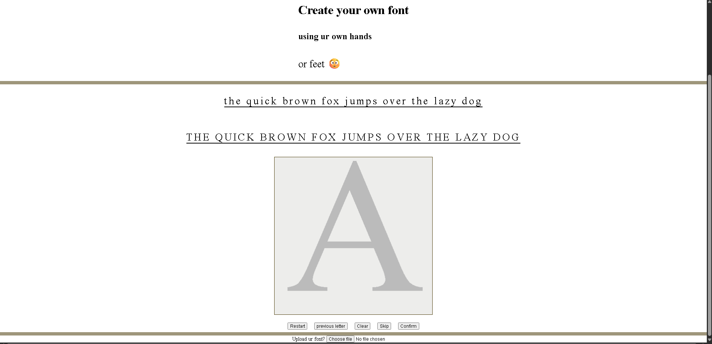

# fonts
can u font?

https://fonts-nu-three.vercel.app/fonts.html
(check it out)
btw its a project for Hackclub!!!!
## whats dis bro
This is my latest fontmakinator 
draw ur own alphabetic characters and get them compiled into a downloadable font
you can use ur hands , feet 😳 , uhh nose etc , just write sum letters , even 5 year ols can do it.

## what are the features?

-  you can make ur own font obv
-  you can see a live application of ur font to the pangrams above (pangrams r sentences which hav all the letters from the alphabet) yes im smart
-  you can clear a sketch , move back to previous character , a restart button if u get troubled with ur life choices or jus need to clear the local storage eh skip button incase u lazy.
-  oh yea u can also upload a previously generated font , or any font , to preview directly without having to sketch a new one.
-  and idk maybe its useful to you? it was to me , so thats a feature
-  all bugs are features
-  nvm there are no bugs
-  many features

## how did i make it?

good question, bear wimme 

-  html: obv
-  CSS: very handy
-  javascript: is like the most of it 
-  opentype JS: ugh it was so hard but i needed it for the font glyphs n stuff
-  vscode : its better den notepad
-  Claude: very good at finding typos (witdh ==> width 😭) used for debugging and help with opentype js
-  water: less den data centers but tryna get to 8 glasses a day

## Why did u make it?

Umm...why not?

well i did make it cuz my frens were askin which fonts look better on their site and i was like bruh i wish i culd jus write it by hand 
and den i was like oh yea , maybe i can, i hope they put my font on their site but i think it might be a lil ugly since my handwriting wasnt the best in class , and this aint even handwriting 😭 its sum kinda finger writing? , or maybe if i use a stylus yeah then it would kinda resemble real handwriting
but actually when you write indivisual letters it kinda just doesnt feel original , so maybe for my next project ill make a script that scans ur handwriting through ur pics and turns it into a font? 
it could be AI but its expensive , so it culd be python but i need to learn it more.
anyways try it out and see what ur font looks like cuz im pretty sure that its better den mine ✌️

## Screenshot? 
uhh sure..

### ik i need to work on designs but for now it serves the purpose it needs to 😋